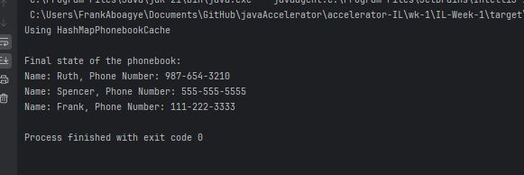
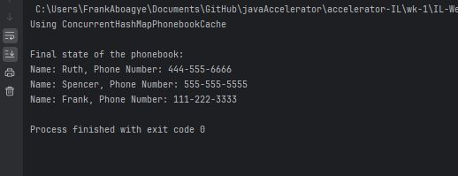

# Solutions
- [Implement a Design Pattern](#implement-a-design-pattern)
- [Leverage Inner Classes for Data Encapsulation](#leverage-inner-classes-for-data-encapsulation)
- [Create a Generic Method for Data Validation](#create-a-generic-method-for-data-validation)
- [Design a Generic Class for Stack Data Structure](#design-a-generic-class-for-stack-data-structure)
- [Implement a Thread-Safe Cache using ConcurrentHashMap](#implement-a-thread-safe-cache-using-concurrenthashmap)
- [Process a Collection using Stream API and Custom Comparator](#process-a-collection-using-stream-api-and-custom-comparator)
---
- [Handling Checked and Unchecked Exceptions](#handling-checked-and-unchecked-exceptions)
- [Utilizing Nested Try-Catch Blocks](#utilizing-nested-try-catch-blocks)
- [Releasing Resources with finally Block](#releasing-resources-with-finally-block)
- [Creating a Custom Exception](#creating-a-custom-exception)
---
- [Implement a Thread Pool for Image Processing](#implement-a-thread-pool-for-image-processing)
- [Leverage ConcurrentHashMap for Thread-Safe Caching](#leverage-concurrenthashmap-for-thread-safe-caching)
- [Synchronized Block for Updating a Shared Counter](#synchronized-block-for-updating-a-shared-counter)
- [Deadlock Example and Prevention](#deadlock-example-and-prevention)
---
- [Implement a Balanced Binary Search Tree (AVL Tree)](#implement-a-balanced-binary-search-tree-avl-tree)
- [Utilize a Heap for Task Scheduling](#utilize-a-heap-for-task-scheduling)
- [Build a Trie for Autocomplete Functionality](#build-a-trie-for-autocomplete-functionality)
- [Implement Depth-First Search (DFS) on a Graph](#implement-depth-first-search-dfs-on-a-graph)
- [Find the Shortest Path with Dijkstra's Algorithm](#find-the-shortest-path-with-dijkstras-algorithm)
- [Calculate Minimum Spanning Tree with Prim's Algorithm](#calculate-minimum-spanning-tree-with-prims-algorithm)
---
- [Implement a Greedy Algorithm for the Fractional Knapsack Problem](#implement-a-greedy-algorithm-for-the-fractional-knapsack-problem)
- [Solve the Longest Common Subsequence (LCS) Problem using Dynamic Programming](#solve-the-longest-common-subsequence-lcs-problem-using-dynamic-programming)

---
---
## Implement a Design Pattern
- creating a text formatter for a text editor
- a text editor can have different text formatters
- so we will have a bunch of text formatters and pass the required one

  - to the text editor in order to formate a text

- Using the `Strategy Design Pattern`

  - A family of algorithms encapsulating one another
  - Keep the implementations of each of the algorithms in a separate class (Strategy)
  - any object using the strategy object - called - context object
  - strategy objects must be designed to offer the same interface
  - what a client needs to do is to configure the context, with the selected strategy instance
  - what do we have
    - `Strategy`:
      - declares the interface common to all supported algorithms
      - note that `context` will use this interface to call the algorithm defined by the `concrete strategy`
    - `Concrete Strategy`:
      - implements the algorithm using the `strategy` interface
    - `Context`:
      - congfigured with a `concrete strategy` object
      - maintains a reference to the `strategy` object
      - may define an interface that lets `strategy` access its data

- [Solution - ./src/main/java/frank/oop_deep_dive/labone](./src/main/java/frank/oop_deep_dive/labone)
    - `CapTextFormatter`, is a concrete text formatter that implements the TextFormatter interface and the class is used to change the text into capital case
    - The `LowerTextFormatter` is a concrete text formatter that implements the TextFormatter interface and the class is
used to change the text into small case.
    - `TextEditor` class holds a reference to the `TextFormatter` interface

- Advantages
    -  We can add new text formatters without disturbing the current code


## Leverage Inner Classes for Data Encapsulation
- Outer Class: `Rocket` 🚀
- Attributes:
    - `name`: The name of the rocket.
    - `weight`: The weight of the rocket (in kilograms).
- Methods:
    - `toString()`: Returns a string representation of the rocket.
    - `displayRocketDetails()`: Prints the rocket's details to the console.
- Inner Class: `Engine`
    - Attributes:
        - `type`: The engine type (e.g., liquid, solid).
        - `thrust`: The thrust generated by the engine (in Newtons).
    - Methods:
        - `calculateThrustToWeightRatio()`: Calculates and returns the thrust-to-weight ratio for the rocket.
        - `displayEngineDetails()`: Prints the engine's details, including the thrust-to-weight ratio.

The inner class Engine provides functionality closely tied to the outer class Rocket, such as calculating the thrust-to-weight ratio using the rocket's weight.

- [Solutions - ./src/main/java/frank/oop_deep_dive/labtwo](./src/main/java/frank/oop_deep_dive/labtwo)


## Create a Generic Method for Data Validation
-  what i did was a Baking Validation Utility
- Generic Validation: Supports validation for different types of data (Integer, String, Double, etc.).
- Modularity: I placed each validation logic in a separate class, improving code clarity.
- Extensibility: New validation criteria can be added easily by implementing the `BakingValidator<T>` interface.
- Structure
    - Interface
        - `BakingValidator<T>`: A generic interface for defining validation criteria.
    - Validators
        - `TemperatureValidator`: Validates if a temperature is within the baking range (150–250°C).
        - `IngredientNameValidator`: Validates that ingredient names are non-empty and not too long (max 30 characters).
    - `WeightValidator`: Validates if an ingredient's weight is within 0–1000 grams.

- [Solution - ./src/main/java/frank/generics_in_depth/lab3](./src/main/java/frank/generics_in_depth/lab3)


## Design a Generic Class for Stack Data Structure
- The class MyStack<T> uses a type parameter T, which allows the stack to hold any data type (like Integer, String, etc.).
- It uses an array (`Object[]` stack) to store elements. The array resizes when it reaches capacity.
- When the stack is full, it doubles the array size to accommodate more elements
- operations
    - `push(T item)`: Adds an element to the top of the stack.
    - `pop()`: Removes and returns the top element.
    - `peek()`: Returns the top element without removing it.
    - `isEmpty()`: Checks if the stack is empty.
    - `size()`: Returns the number of elements in the stack.

- [Solution - ./src/main/java/frank/generics_in_depth/lab4/](./src/main/java/frank/generics_in_depth/lab4/)

## Implement a Thread-Safe Cache using ConcurrentHashMap
- `PhonebookCache Interface`: I defined the  operations such as adding, updating, removing, and retrieving contacts.
- `HashMapPhonebookCache`: Uses HashMap for non-thread-safe operations.
- `ConcurrentHashMapPhonebookCache`: Uses ConcurrentHashMap for thread-safe operations.
- `File Persistence`: Contact information is written to a file (phonebook.txt) after each modification to observe the effects of concurrent modifications.
- `Multithreading`: Simulates concurrent access using multiple threads to add, update, and remove contacts.

| **Image 1**                     | **Image 2**                     |
|----------------------------------|----------------------------------|
|  |  |
| Was not able to update the contact witht the `hashMap` | Update happened because of the `concurrent hash map` |


- [Solution - ./src/main/java/frank/generics_in_depth/lab5/](./src/main/java/frank/generics_in_depth/lab5)


## Process a Collection using Stream API and Custom Comparator
- `Collection of Candidates`
    - The data consists of a list of candidates running for the election, with their respective details such as name, age, party, and number of votes received.
- `Custom Comparator`
    - A custom comparator is used to sort the candidates first by the number of votes received (in descending order) and then by age (in ascending order) when votes are the same.
- `Stream API Operations`
    - `Filter`: Only candidates aged 55 and above are retained.
    - `Transform`: The candidates' information is transformed into a readable string format displaying their name, party, and votes received.
    - `Process`: The total number of votes from the filtered candidates is calculated.
- [Solution - ./src/main/java/frank/generics_in_depth/lab6](./src/main/java/frank/generics_in_depth/lab6)

---

## Handling Checked and Unchecked Exceptions
- Created a `Ghana Election Result Processor` class
- processes Ghana's election results from a CSV file, declaring Frank Aboagye as the independent candidate winner! 🎉\
- 🚀 Features
    - Reads election results from a CSV file.
    - Handles:
        - `Checked Exceptions`: Ensures safe file handling.
        - `Unchecked Exceptions`: Validates data correctness.
    - Outputs the election winner.
```csv
# example CSV Data
candidate,votes
Frank Aboagye,102345
Jane Doe,98765
John Smith,54321
```

- Exception Types and Names

| **Type**              | **Exception Name**               | **Description**                                                                                                                                         |
|-----------------------|----------------------------------|---------------------------------------------------------------------------------------------------------------------------------------------------------|
| **Checked Exception** | `IOException`                   | Thrown if there is an error while reading the election results file (e.g., file not found or cannot be opened).                                         |
| **Unchecked Exception** | `IllegalArgumentException`      | Thrown if the file contains malformed data (e.g., invalid CSV structure or non-numeric vote count).                                                     |
| **Unchecked Exception** | `NumberFormatException`         | Thrown internally within `IllegalArgumentException` when parsing a non-numeric vote count.                                                              |
| **Unchecked Exception** | `IllegalArgumentException`      | Thrown when attempting to determine a winner but the results are empty or invalid (e.g., no data in the map).                                           |

- [Solution - ./src/main/java/frank/exceptionhandlinginjava/ex1_checkandunchecked/GhanaElectionProcessor.java ](./src/main/java/frank/exceptionhandlinginjava/ex1_checkandunchecked/GhanaElectionProcessor.java)

---

## Utilizing Nested Try-Catch Blocks

- I demonstrate the use of nested try-catch blocks to handle different levels of exceptions in a simulated airplane control system.

- Layout Diagram

```text
+-------------------------------------------+
| Main Control System (Outer Try Block)     |
|  - Handles overall system failures        |
|                                           |
|   +-----------------------------------+   |
|   | Navigation Subsystem (Inner Try)  |   |
|   |  - Manages navigation operations  |   |
|   |                                   |   |
|   |   +---------------------------+   |   |
|   |   | Sensor Data Fetch (Try)  |   |   |
|   |   |  - Handles sensor errors |   |   |
|   |   +---------------------------+   |   |
|   +-----------------------------------+   |
+-------------------------------------------+

```

- Exception Handling Table

| Level                     | Responsible Block        | Exception Type                | Handling Mechanism                                     |
|---------------------------|--------------------------|-------------------------------|------------------------------------------------------|
| Main Control System       | Outer Try-Catch Block    | `NullPointerException`        | Activates emergency protocols                        |
| Navigation Subsystem      | Inner Try-Catch Block    | `IllegalArgumentException`    | Switches to manual navigation mode                  |
| Sensor Data Fetch         | Innermost Try-Catch Block| `ArithmeticException`         | Uses redundant sensor data                           |

- [Solution - ./src/main/java/frank/exceptionhandlinginjava/ex2_nestedtrycatch/AirplaneSimulation.java ](./src/main/java/frank/exceptionhandlinginjava/ex2_nestedtrycatch/AirplaneSimulation.java)


## Releasing Resources with finally Block
- Here, I created a program that demonstrates how to open and display an animated GIF while ensuring proper resource management.
- The program will open a window displaying the animated GIF! 🎬
- 🛠️ Features:
    - **Releasing Resources**: The `finally` block ensures that the file input stream is closed properly, even if an exception occurs, preventing resource leaks. 🧹

- 

- [Solution - ./src/main/java/frank/exceptionhandlinginjava/ex3_releaseingresources/GifDisplay.java](./src/main/java/frank/exceptionhandlinginjava/ex3_releaseingresources/GifDisplay.java)


## Creating a Custom Exception
- The application uses Java Swing for the GUI, and a custom exception is implemented to handle invalid input scenarios (like an empty name).
- Custom Exception
    - The `FrankCustomException` is a custom runtime exception used to indicate that the user has entered an invalid name (in this case, an empty string). It extends the `RuntimeException` class and is thrown when the input field is empty.

- [Solution - ./src/main/java/frank/exceptionhandlinginjava/ex4_customexception/](./src/main/java/frank/exceptionhandlinginjava/ex4_customexception/)

---

## Implement a Thread Pool for Image Processing
- I created a GUI application to process images using a thread pool
- The ExecutorService manages threads, and logic for converting images to black and white
- An ExecutorService with a fixed thread pool is created to manage threads efficiently based on available CPU cores.
- Image processing tasks run concurrently.
- Logs are updated in the Event Dispatch Thread using `SwingUtilities.invokeLater()` to ensure thread safety.

- [Solution - ./src/main/java/frank/JavaConcurrency/ImageProcessingApp.java](./src/main/java/frank/JavaConcurrency/ImageProcessingApp.java)

- Execution Flow Diagram
    - Below is the execution flow of the application, showing how the Thread Pool fits into the design:

```plaintext
                      +-------------------------+
                      |       User GUI         |
                      |    (Swing JFrame)      |
                      +-------------------------+
                                  |
                                  v
                  +------------------------------+
                  | Select Images Button Clicked |
                  +------------------------------+
                                  |
                                  v
                      +-------------------+
                      | JFileChooser Opens |
                      +-------------------+
                                  |
                                  v
              +----------------------------------+
              | Selected Files Passed to Thread |
              |            Pool                 |
              +----------------------------------+
                                  |
                +-------------------------+------------------+
                |                         |                  |
                v                         v                  v
      +-----------------+       +-----------------+  +-----------------+
      | Image Task 1    |       | Image Task 2    |  | Image Task N    |
      +-----------------+       +-----------------+  +-----------------+
                |                         |                  |
                v                         v                  v
  +-----------------------+   +-----------------------+  +-----------------------+
  | Convert to Black/White|   | Convert to Black/White|  | Convert to Black/White|
  +-----------------------+   +-----------------------+  +-----------------------+
                |                         |                  |
                v                         v                  v
  +-----------------------+   +-----------------------+  +-----------------------+
  | Save Processed Image  |   | Save Processed Image  |  | Save Processed Image  |
  +-----------------------+   +-----------------------+  +-----------------------+
                |                         |                  |
                v                         v                  v
     +-----------------------------------------------------------+
     |                   Update Log in GUI                       |
     +-----------------------------------------------------------+
```

---

## Synchronized Block for Updating a Shared Counter
- The `counter` variable is shared between both windows.
- I created a two windows display but they can independently control their timers
- The synchronized block inside the increment() method ensures that only 
    - one thread can modify the counter at a time, which guarantees that both windows 
    - are displaying the correct, incremented counter value.
- Window 1 increments the counter every second, while Window 2 increments it every 0.8 seconds.
- [Solution - ./src/main/java/frank/sharedcounter/MultiWindowSharedCounterApp.java](./src/main/java/frank/sharedcounter/MultiWindowSharedCounterApp.java)

```plaintext
+-------------------+     +-------------------+
|   Window 1        |     |   Window 2        |
|-------------------|     |-------------------|
|  Counter Display  |     |  Counter Display  |
|  Start Button     |     |  Start Button     |
|  Stop Button      |     |  Stop Button      |
+-------------------+     +-------------------+
         |                        |
         |                        |
         |       Shared Counter   |
         |          (Thread-Safe) |
         +------------------------+
                    |
                    v
               +-------------------+
               | Shared Counter     |
               | (Thread-Safe)      |
               +-------------------+
                    |
                    v
                +-------------------+
                |  Increment Method |
                | (Synchronized)    |
                +-------------------+

```


## Deadlock Example and Prevention
- In the `DeadlockSimulation` class
    - Thread 1 locks resource1, then tries to lock resource2.
    - Thread 2 locks resource2, then tries to lock resource1.
    - this I think will cause a deadlock because each thread is waiting for the other to release the resource.
- `Avoiding the Deadlock`:
    - in the `NoDeadlockSimulation` class
        - Both Thread 1 and Thread 2 now lock resource1 first, then lock resource2.
        - This ensures that no thread will be waiting indefinitely, and no deadlock will occur.

- [Solution - ./src/main/java/frank/deadlock/](./src/main/java/frank/deadlock/)


## Implement a Balanced Binary Search Tree (AVL Tree)
- [Solution - ./src/main/java/frank/advanceDS/avltree/MyAVLTree.java ](./src/main/java/frank/advanceDS/avltree/MyAVLTree.java)

## Utilize a Heap for Task Scheduling
- [Solution - ./src/main/java/frank/advanceDS/taskscheduling/](./src/main/java/frank/advanceDS/taskscheduling/)

## Build a Trie for Autocomplete Functionality
- [./src/main/java/frank/advanceDS/autocomplete/Trie.java](./src/main/java/frank/advanceDS/autocomplete/Trie.java)

##  Implement Depth-First Search (DFS) on a Graph
- [./src/main/java/frank/advanceDS/graph/DFSExample.java](./src/main/java/frank/advanceDS/graph/DFSExample.java)

##  Find the Shortest Path with Dijkstra's Algorithm
- Scenario: Road Network
    - In this road network, there ate cities (nodes) connected by roads (edges). 
    - Each road has a specific distance (weight). 
    - The goal is to find the shortest path between two cities using Dijkstra's algorithm
- [./src/main/java/frank/advanceDS/roadnetwork/](./src/main/java/frank/advanceDS/roadnetwork/)

##  Calculate Minimum Spanning Tree with Prim's Algorithm
- [./src/main/java/frank/advanceDS/MST/](./src/main/java/frank/advanceDS/MST/)

## Implement a Greedy Algorithm for the Fractional Knapsack Problem
- `Item` Class: value and a weight.
    - I calculate the value-to-weight ratio using the `getValuePerWeight` method.
- items are sorted in descending order based on their value-to-weight ratio. 
- `Greedy Selection`: The algorithm iterates over the sorted list of items, adding full items to the knapsack if possible. 
    - If an item can't fit completely, the algorithm adds the fractional part of the item that fits.
    - The `getMaxValue` method returns the maximum value that can be carried in the knapsack given the capacity.
- [Solution - ](./src/main/java/frank/advanceDS/advancealgorithms/greedy/)

## Solve the Longest Common Subsequence (LCS) Problem using Dynamic Programming
- [./src/main/java/frank/advanceDS/advancealgorithms/lcs/LCS.java](./src/main/java/frank/advanceDS/advancealgorithms/lcs/LCS.java)


