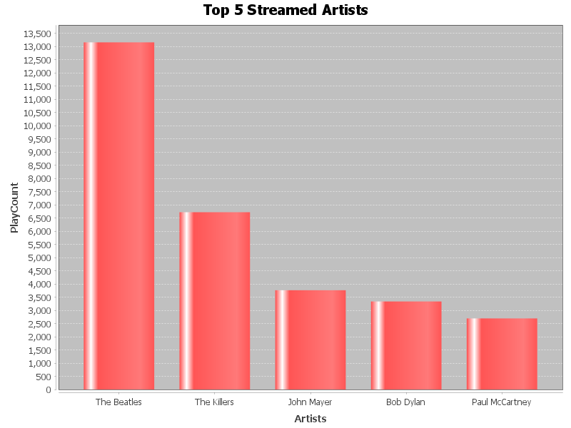

# Java Application to process and Analyse Spotify Streaming History
- link to data 
    - [https://mavenanalytics.io/data-playground](https://mavenanalytics.io/data-playground)
- Things to note about the simple application
     - `CSVReader` → Reads data from the CSV file
     - `DataProcessor` → Analyzes streaming data
     - `ChartGenerator` → Creates and saves a bar chart
     - `SpotifyDataProcessor` → Main controller that orchestrates the process

    - output of the analysis
        - 

- Using a profiling tool
    - types
        - `instrumenting profilers`
            - insert method invocation logging into the application code
            - offers very limited information
            - associated with serious overhead
        - `sampling profilers`
            - receives from the JVM stack trace, aggregates them, to give the overall picture of the execution
            - has smaller overhead
            - the results can sometimes be inaccurate (cos, it depends at what point in time the samples were taken)
    - some of the profiling tools out there (for java applications)
        - `Java Flight Recorder (JFR) & JDK Mission Control`
            - built into the openJDK
            - JFR recordings are binary log files that can be analysed on the jdk mission control
            - `pros`
                - easy to use, can profile a very large number of event, low overhead (so can be used in production)
            - `cons`
                - not suitable for distributed systems, only .jfr files
        - `VisualVM `
            - opensource, uses the JMX (Java Managemnt Extension) API to collect the data
            - can have additional plugins
            - `pros`
                - easy to use, free, open source, 
            - `cons`
                - limited functionality
        - `Async Profiler`
            - free, opensource, collect data on cpu cycles, hardware and software counters, e.t.c
            - produces .jfr files (then use the mission control to analyse it) and flame graphs
            - `pros`
                - low overhead, embeddable
            - `cons`
                - no gui, not available for windows
        - `New Relic`
            - profiler + application monitoring tool
            - offers wide variety of features; subscription plan
            - `pros`
                - advance analytics and performance monitoring
                - suitable for distributed sytems
            - `cons`
                - takes time to set up and more features = subscription
        - `Digma.ai`
            - integrate into intellij as a plugin
            - uses openTelemetry
            - main focus is on the code, but can do some other things too
            - `pros`
                - easy to use, unique insight into the code
            - `cons`
                - limited analytics of low level JVM processes
                - only in intelliJ
        - `JProfiler`
            - java profiler  + interface, wide range of features
            - uses some advance tools too; can b be used separately or integrated into an IDE as plugin
            - `pros`
                - wide range of profiling areas + convinient UI
            - `cons`
                - it is a commercial product
        - `YourKit`
            - can retrieve data about multiple areas, comes with a UI, can be used as a cmd tool 
            - can analyse possible improvements
            - `pros`
                - deep analytics, unique features
            - `cons`
                - commerical product


- Sample Short
    - 
    - 


- Bottleneck identified
    - reading of the CSV file

```java

// first


// second


```
